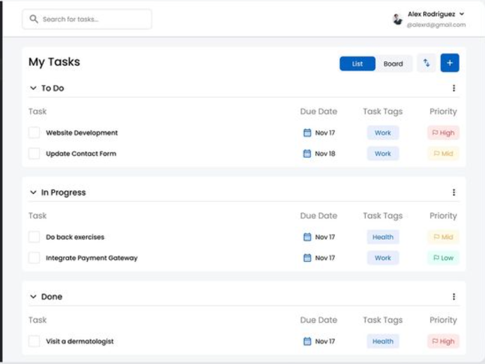

# Implementasi penggunaan ref

## tampilan ini adalah todo list yang menggunakan ref dalam manipulasi data

## Screenshot:
<table>
    <tr>
        <td>
            
        </td>
        <td>
            
        </td>
        <td>
            
        </td>
    </tr>
    <tr>
        <td>
            Contoh halaman
        </td>
        <td>
            Implementasi Desain
        </td>
        <td>
            Screenshoot Input data dengan modal
        </td>
    </tr>
</table>

Pada tampilan ini merupakan tampilan todo list dengan menggunakan ref dan forwardref untuk manipulasi data, dimana kita input list akan masuk ke bagian todo terlebih dahulu, ketika di ceklist akan berpindah ke bagian proses, setlah di proses di ceklist akan pindah ke bagian done. 
